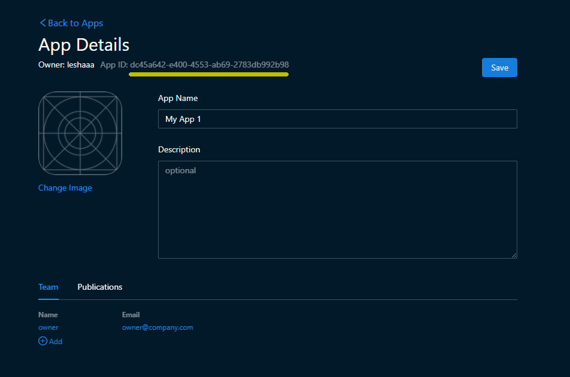
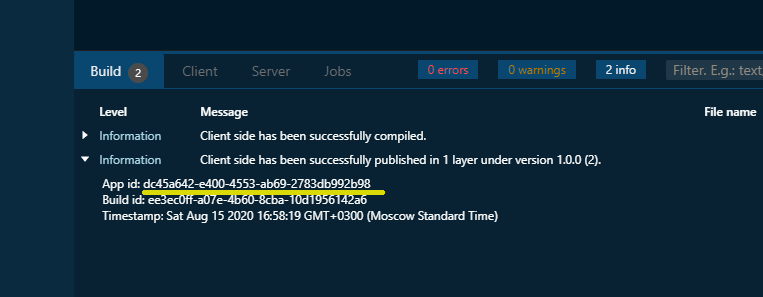

# How to submit an issue on GitHub

You can submit an issue [here](https://github.com/SpheroidUniverse/SpheroidScript/issues/new). 
If you don't have a GitHub account yet, sign up [here](https://github.com/join).

To help us to solve your issue in the most efficient way, we kindly ask you to follow the below recommendations:
* Tell us your app id
* Share access to your app to the support team
  
## Tell us your app id

You can find the app id on the app page. Open the "Apps" tab and open the app details page 
by clicking on the preview. You will see the app id next to the owner name.

 
You can also find app id in logs that appear in the bottom pane 
while compiling or while working on the mobile device.

## Share access to your app to the support team

You can also share access to your app to the Spheroid Universe support team. 
This way you allow us to access your app files, so we are able to repeat 
your steps to reproduce the problem. Though it's an optional step, sometimes 
it may be the most efficient, and the fastest way to find a solution to your issue. 

To share your app with our team, open the "Apps" tab, then open the app details by clicking on the app tile. 
Click the "Add" button below the list of team members in the "Team" tab. When the dialog comes up, fill out 
the form with "SpheroidSupport" and "support@spheroiduniverse.io", then click "Add" and "Save".

Please note, if you don't see the "Add" button in the "Team" tab, it means you're not an owner of this app and therefore can't add a new member.

