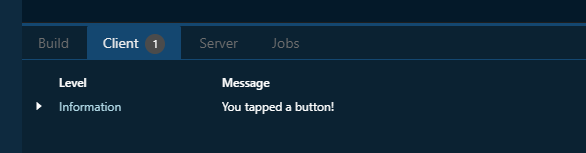
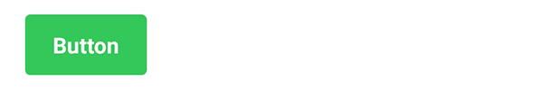
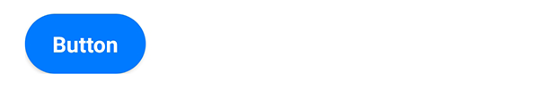
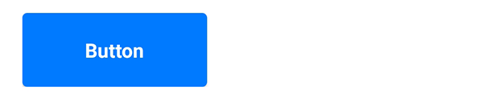
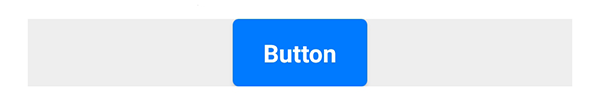
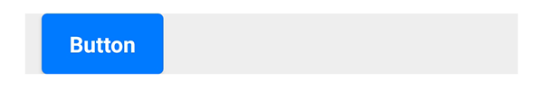
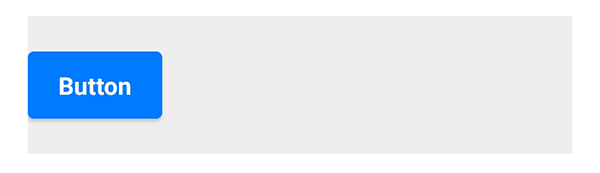
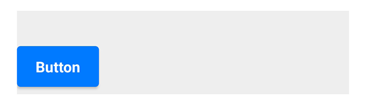

# Button

On this page, we focus on one of the basic components of Spheroid UI Engine, a Button.
You can find a quickstart with all source code you need to try the examples 
[here](https://github.com/SpheroidUniverse/SpheroidScript/tree/master/examples/UI).

When creating an instance of the Button class, you need to set the `text` property. 
The value should be the text you want to appear on the button.

Below, you will find the examples of using the Button class with different properties.
The images corresponding to each example illustrate how the button will look 
on the mobile device when using different settings and styles.

## Default settings

This is how the button looks by default:

```
Button(text = "Button")
```


## Visibility

A button is visible by default. However, there are 
cases when you need to turn the visibility on and off. You do this by setting the `isVisible`
property value `true` or `false`.

## `onClick` event handler

As you obviously will want to execute some kind of script when a button is tapped,
add the `onClick` event handler to a button. In an example, we just want to
print a log message: 

```
Button(text = "Button").onClick { 
    println("You tapped a button!")
}
```


The log is displayed in the "Client" tab of the 
[Spheroid Demiurge IDE](https://demiurge.spheroiduniverse.io/ide):




## Color

You can change the button's color by setting the `backgroundColor` property 
value using the [Color](../reference/spheroid.client.ui/-color/index.md) class instance.
This is, for example, what you need to do if you want your button to be green:

```
Button(text = "Button", backgroundColor = Color(rgb = 0x34C759))
```



## Corner radius

By default, a button is slightly rounded. You can make it more rounded by setting the
`cornerRadius` property with a higher value:

```
Button(text = "Button", cornerRadius = 22dp)
```



You also can remove the rounding by setting `cornerRadius = 0`.

Note that the same corner radius will look different when used on buttons 
of different width and height.

## Text alignment

The `textAlign` property sets the button text alignment to left, right or center:

```
Button(text = "Button", textAlign = "left")
```


## Width and height

The button size depends on the text length and adjusts automatically.
However, you can set fixed values using the `width` and `height` properties:

```
Button(text = "Button", width = 150dp, height = 60dp)
```




## Horizontal and vertical alignment

A button exists in a container, and is aligned to top left by default.
If you want to change these settings, use one of the following properties. 

The `horizontalAlign` property sets the horizontal alignment of the button
to left, right or center:

```
Container(backgroundColor = Color(rgb = 0xEEEEEE)) {
    Button(text = "Button", horizontalAlign = "center")
}
```



The `left` and `right` properties allow you to place the button 
at an exact distance from the left or the right border of the container:

```
Container(backgroundColor = Color(rgb = 0xEEEEEE)) {
    Button(text = "Button", left = 12dp)
}
```



The `verticalAlign` property sets the vertical alignment of the button
to top, bottom or center:

```
Container(backgroundColor = Color(rgb = 0xEEEEEE), height = 90dp) {
    Button(text = "Button", verticalAlign = "center")
}
```



Using the `top` and `bottom` properties, you can customize 
the distance between the button and the top or the bottom border of the container:

```
Container(backgroundColor = Color(rgb = 0xEEEEEE), height = 90dp) {
    Button(text = "Button", bottom = 8dp)
}
```



## Related Links

- [Button class reference](../reference/spheroid.client.ui/-button/index.md)
- [Full list of UI components](index.md)
- [UI Demo App](https://github.com/SpheroidUniverse/SpheroidScript/tree/master/examples/UI)
- [Got a question? Submit an issue on GitHub](../submit-an-issue.md)