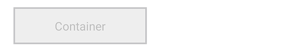
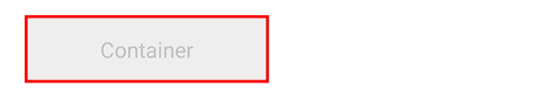
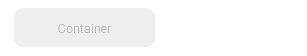
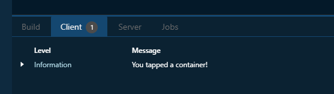
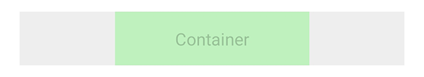
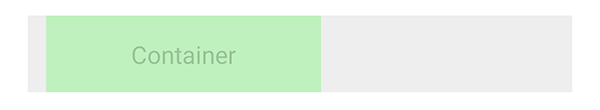
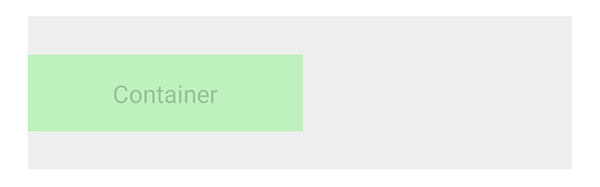
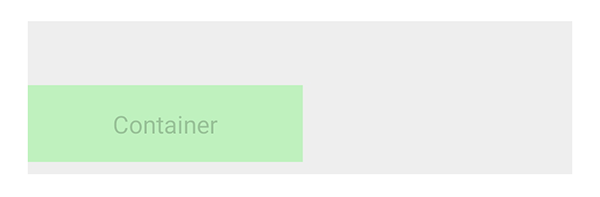

# Container

On this page, we focus on one of the basic components of Spheroid UI Engine, a Container.
You can find a quickstart with all source code you need to try the examples 
[here](https://github.com/SpheroidUniverse/SpheroidScript/tree/master/examples/UI).

A container is an instrument allowing you to organize the content on the screen.
Buttons, images, animations, icons, text and other elements can be placed 
inside a container. A container can also be nested inside another container. In most cases, 
you don't want to make the container visible on screen, so by default it's 
transparent. However, sometimes you may need to style the container, for instance,
change the alignment or rotate it.

Below, you will find the examples of using the Container class.
The images corresponding to each example illustrate how the container will look 
on the mobile device when using different settings and styles.

## Basic usage

When creating an instance of Container class, you don't necessary need to set any properties.
However, as by default container is transparent, we're using a
[Color](../reference/spheroid.client.ui/-color/index.md) class instance in an example 
to set the `backgroundColor` property value.
We're setting the `width` and `height` property values as well.
Also, in an example we're using a [Text](../reference/spheroid.client.ui/-text/index.md) 
component inside a container, to make it obvious where the container is, 
as well as to demonstrate the possibility to place elements inside a container.

```                
Container(backgroundColor = Color(rgb = 0xEEEEEE), width = 180dp, height = 50dp) {
    Text(text = "Container", textColor = Color(rgba = 0x00000033), horizontalAlign = "center", verticalAlign = "center")
}
```


## Visibility

A container is visible by default, though transparent.
However, there are cases when you need to turn the visibility on and off. 
You do this by setting the `isVisible` property value `true` or `false`. If you set `false`,
all elements inside a container will become invisible too.

## Background color

If you need to change the background color, use the `backgroundColor` property:

```                
Container(backgroundColor = Color(rgb = 0xFFFF00), width = 180dp, height = 50dp) {
    Text(text = "Container", textColor = Color(rgba = 0x00000033), horizontalAlign = "center", verticalAlign = "center")
}
```


## Border width

Use the `borderWidth` property to customize the border width of a container:

```
Container(backgroundColor = Color(rgb = 0xEEEEEE), width = 180dp, height = 50dp, borderWidth = 2dp) {
    Text(text = "Container", textColor = Color(rgba = 0x00000033), horizontalAlign = "center", verticalAlign = "center")
}
```



## Border color

Set the `borderColor` property value to highlight the border: 

```
Container(backgroundColor = Color(rgb = 0xEEEEEE), width = 180dp, height = 50dp, borderWidth = 2dp, borderColor = Color(rgb = 0xFF0000)) {
    Text(text = "Container", textColor = Color(rgba = 0x00000033), horizontalAlign = "center", verticalAlign = "center")
}
```



## Corner radius

If you need to make the container rounded, use the `cornerRadius` property:

```
Container(backgroundColor = Color(rgb = 0xEEEEEE), width = 180dp, height = 50dp, cornerRadius = 12dp) {
    Text(text = "Container", textColor = Color(rgba = 0x00000033), horizontalAlign = "center", verticalAlign = "center")
}
```



## Rotation

Sometimes styling the content may requires rotating it. When you rotate a container,
all elements you placed inside it rotate as well. 
Use [Angle](../reference/spheroid.client.ui/-angle/index.md) class to set 
the `rotation` property value:

```                
Container(height = 65dp) {
    Container(backgroundColor = Color(rgb = 0xEEEEEE), width = 180dp, height = 50dp, rotation = Angle(degree = -5), verticalAlign = "center", left = 1dp) {
        Text(text = "Container", textColor = Color(rgba = 0x00000033), horizontalAlign = "center", verticalAlign = "center")
    }
}
```


## `onClick` event handler

With the `onClick` event handler, you have the means to execute a script 
when any place inside a container is tapped. 
This allows to emulate a button, as well as 
to define an area that can be tapped to trigger the script execution.
In an example, we just want to print a log message: 

```
Container(backgroundColor = Color(rgb = 0xEEEEEE), width = 180dp, height = 50dp) {
    Text(text = "Container", textColor = Color(rgba = 0x00000033), horizontalAlign = "center", verticalAlign = "center")
}.onClick { 
    println("You tapped a container!")
}
```




## Horizontal and vertical alignment

In some cases, you need to change the relative position of one container to another container.
You have a set of properties to do this.

The `horizontalAlign` property sets the horizontal alignment of the container
to left, right or center:

```
Container(backgroundColor = Color(rgb = 0xEEEEEE)) {
    Container(backgroundColor = Color(rgba = 0x00FF0033), width = 180dp, height = 50dp, horizontalAlign = "center") {
        Text(text = "Container", textColor = Color(rgba = 0x00000033), horizontalAlign = "center", verticalAlign = "center")
    }
}
```



The `left` and `right` properties allow you to place the container 
at an exact distance from the left or the right border of the bigger container:

```
Container(backgroundColor = Color(rgb = 0xEEEEEE)) {
    Container(backgroundColor = Color(rgba = 0x00FF0033), width = 180dp, height = 50dp, left = 12dp) {
        Text(text = "Container", textColor = Color(rgba = 0x00000033), horizontalAlign = "center", verticalAlign = "center")
    }
}
```



The `verticalAlign` property sets the vertical alignment of the container
to top, bottom or center:

```
Container(backgroundColor = Color(rgb = 0xEEEEEE), height = 100dp) {
    Container(backgroundColor = Color(rgba = 0x00FF0033), width = 180dp, height = 50dp, verticalAlign = "center") {
        Text(text = "Container", textColor = Color(rgba = 0x00000033), horizontalAlign = "center", verticalAlign = "center")
    }
}
```



Using the `top` and `bottom` properties, you can customize 
the distance between the container and the top or the bottom border of the bigger container:

```
Container(backgroundColor = Color(rgb = 0xEEEEEE), height = 100dp) {
    Container(backgroundColor = Color(rgba = 0x00FF0033), width = 180dp, height = 50dp, bottom = 8dp) {
        Text(text = "Container", textColor = Color(rgba = 0x00000033), horizontalAlign = "center", verticalAlign = "center")
    }
}
```



## Related Links

- [Container class reference](../reference/spheroid.client.ui/-container/index.md)
- [Full list of UI components](index.md)
- [UI Demo App](https://github.com/SpheroidUniverse/SpheroidScript/tree/master/examples/UI)
- [Got a question? Submit an issue on GitHub](../submit-an-issue.md)
