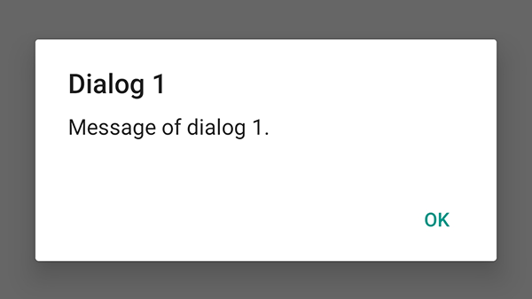
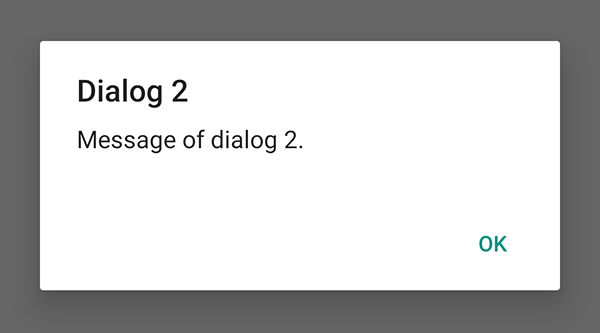
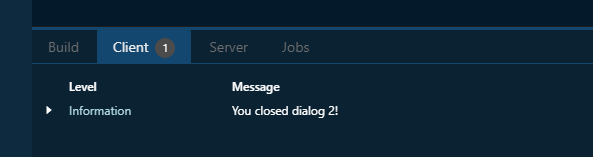

# Dialog

On this page, we focus on one of the components of Spheroid UI Engine, a Dialog.
You can find a quickstart with all source code you need to try the examples 
[here](https://github.com/SpheroidUniverse/SpheroidScript/tree/master/examples/UI).

A Dialog allows you to interact with your app's user, 
showing messages atop of other content
and executing script on closing a dialog, if needed.

Below, you will find the examples of using Dialog class.

## Open

This is how you create a dialog. Note that it has a special `open()` function:

```
fun openDialog1() {
    Dialog(title = "Dialog 1", message = "Message of dialog 1.").open()
}
```

Upon clicking a button, the dialog will open:

```
Button(text = "Open dialog 1", width = 120dp).onClick {
    openDialog1()
}
```




## Execute script on close

Imagine you want to execute script on closing a dialog.
This is how you do this:

```
fun openDialog2() {
    Dialog(title = "Dialog 2", message = "Message of dialog 2.").open {
        println("You closed dialog 2!")
    }
}
```

Upon clicking a button, the dialog will open:

```
Button(text = "Open dialog 2", width = 120dp).onClick {
    openDialog2()
}
```




When you close the dialog, the script will be executed, and the log will be 
displayed in the "Client" tab of the 
[Spheroid Demiurge IDE](https://demiurge.spheroiduniverse.io/ide):



## Related Links

- [Dialog class reference](../reference/spheroid.client.ui/-dialog/index.md)
- [Full list of UI components](index.md)
- [UI Demo App](https://github.com/SpheroidUniverse/SpheroidScript/tree/master/examples/UI)
- [Got a question? Submit an issue on GitHub](../submit-an-issue.md)