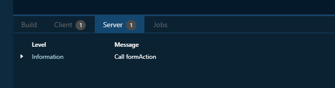
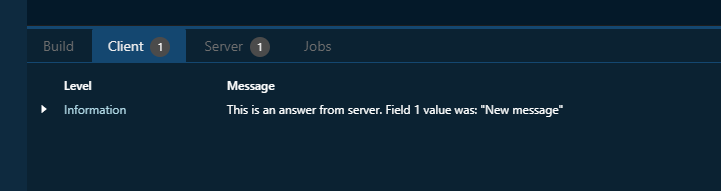

# Form

On this page, we focus on one of the components of Spheroid UI Engine, a Form.
You can find a quickstart with all source code you need to try the examples 
[here](https://github.com/SpheroidUniverse/SpheroidScript/tree/master/examples/UI).

A Form is a complex instrument connecting the client and the server sides.
First, the client side provides the means to show a form on the screen.
After filling in the data and submitting a form, the server side executes the script
and returns a result to the client side.
Upon this another script may also be executed, this time on the client side.

Below, you will find the example of using Form class.

## Basics

On the client side, we create a form, specifying a server action name:

```
Form(action = "formAction") { form ->
    Vertical {
        Container {
            TextField(name = "field1", width = 130dp, borderWidth = 1dp, placeholder = "Field 1")
        }
        Container {
            Button(text = "Submit form 1", width = 130dp).onClick {
                form.submit { result, error ->
                    if (error != null)
                        println(error.toString())
                    else
                        println(result)
                }
            }
        }
    }
}
```

Inside a form, we've created a text field (see more about [TextField](textField.md)).
We've set a text field `name` property value to "field1". 

Earlier, we've specified which action on the server side to call: `action = "formAction"`.
Now, on the server side, we create an action with the same name "formAction".
From this action we can access the text field value: `request.field1`.
Note that we mark the action with the `@Action` decorator.

```
@Action
fun formAction(request) {
    return "This is answer from server. Field 1 was: \"${request.field1}\""
}
```

Let's go through all the steps in our example.

This is an empty form:


Let's type in "New message" and submit a form by clicking a button:


We can see that the `formAction()` has been called in the "Server" tab
of the [Spheroid Demiurge IDE](https://demiurge.spheroiduniverse.io/ide):



The result returned by the server has then been accessed by the client: 
`println(result)`.
We can see the answer from the server in the "Client" tab 
of the [Spheroid Demiurge IDE](https://demiurge.spheroiduniverse.io/ide):



## Related Links

- [Form class reference](../reference/spheroid.client.ui/-form/index.md)
- [Full list of UI components](index.md)
- [UI Demo App](https://github.com/SpheroidUniverse/SpheroidScript/tree/master/examples/UI)
- [Got a question? Submit an issue on GitHub](../submit-an-issue.md)