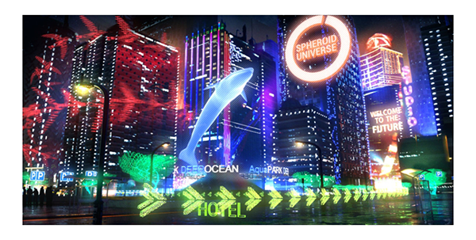
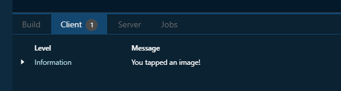
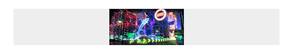
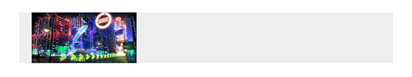
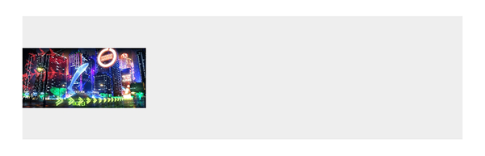
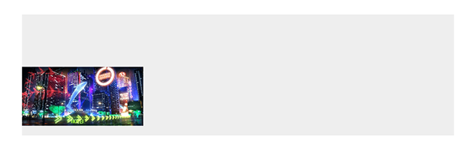

# Image

On this page, we focus on one of the components of Spheroid UI Engine, an Image.
You can find a quickstart with all source code you need to try the examples 
[here](https://github.com/SpheroidUniverse/SpheroidScript/tree/master/examples/UI).

Using Image class allows you to build in images into the pages of your app. 
When creating an instance of Image class,
you need to set the `source` property with the path to the image inside an app using the
[Source](../reference/spheroid/-source/index.md) class.

Below, you will find the examples of using Image class.
The images corresponding to each example illustrate how the image will look 
on the mobile device.

## Default settings

By default, an image occupies the greatest possible area on the screen, not changing its 
proportions:

```
Image(source = Source("/assets/image.png"))
```



## Visibility

An image is visible by default. However, there are 
cases when you need to turn the visibility on and off. You do this by setting the `isVisible`
property value `true` or `false`.

## Width and height

You can set the width and the height of an image with the `width` and `height` properties:

```
Image(source = Source("/assets/image.png"), width = 100dp, height = 50dp)
```


## `onClick` event handler

With the `onClick` event handler, you have the means to execute a script 
when the image is tapped. In an example, we just want to print a log message: 

```
Image(source = Source("/assets/image.png"), width = 100dp).onClick {
    println("You tapped an image!")
}
```




## Horizontal and vertical alignment

Often, you need to change the relative position of an image to the external container.
You have a set of properties to do this. Note that by default the container is transparent, so
we have used a [Color](../reference/spheroid.client.ui/-color/index.md) class instance in the examples.

The `horizontalAlign` property sets the horizontal alignment of the image
to left, right or center:

```
Container(backgroundColor = Color(rgb = 0xEEEEEE)) {
    Image(source = Source("/assets/image.png"), width = 100dp, horizontalAlign = "center")
}
```



The `left` and `right` properties allow you to place the image 
at an exact distance from the left or the right border of the external container:

```
Container(backgroundColor = Color(rgb = 0xEEEEEE)) {
    Image(source = Source("/assets/image.png"), width = 100dp, left = 12dp)
}
```



The `verticalAlign` property sets the vertical alignment of the image
to top, bottom or center:

```
Container(backgroundColor = Color(rgb = 0xEEEEEE), height = 100dp) {
    Image(source = Source("/assets/image.png"), width = 100dp, verticalAlign = "center")
}
```



Using the `top` and `bottom` properties, you can customize 
the distance between the image and the top or the bottom border of the external container:

```
Container(backgroundColor = Color(rgb = 0xEEEEEE), height = 100dp) {
    Image(source = Source("/assets/image.png"), width = 100dp, bottom = 8dp)
}
```



## Related Links

- [Image class reference](../reference/spheroid.client.ui/-image/index.md)
- [Full list of UI components](index.md)
- [UI Demo App](https://github.com/SpheroidUniverse/SpheroidScript/tree/master/examples/UI)
- [Got a question? Submit an issue on GitHub](../submit-an-issue.md)