# Spheroid Script UI Engine

This guide describes how to create custom UI using Spheroid Script.

## About Spheroid UI Engine

Spheroid UI Engine allows you to create user interfaces that include
a variety of menus, buttons, lists, cards, interactive data entry forms,
profiles, sorts, dialog boxes, information pages, and other elements necessary
for developers to create XR applications.

Traditionally, it is believed that in order to make a high-quality interface,
it is necessary to create it for each platform (iOS and Android) separately.
Spheroid Script eliminates the need for developers to do double work.
The interfaces created in Spheroid Script are high-quality and responsive,
just like the native ones, while Spheroid Script provides a significantly lower
entry threshold for developers, simplifying and speeding up development,
making any changes in the interface possible even after the user has downloaded
and installed the application.

With the help of the Spheroid UI Engine, you can create and embed any interfaces
into your XR application, for example: a storefront with goods, social media feed,
pages with settings for your XR application, or even a messenger.

## How does UI look if it built on Spheroid UI Engine 

Look at the third image. This is a page displaying the Rarura AR game description.
This page has been created solely and completely on Spheroid UI Engine.

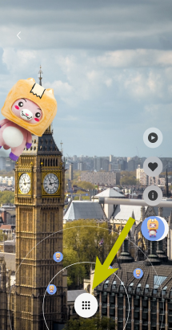 &nbsp;
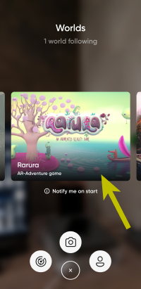 &nbsp;
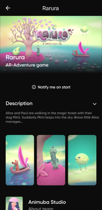

There are images, texts, icons, and controls on this page.
All elements are aligned relatively to one another and form
a finished composition in their integrity.
If you tapped the “Notify me on start” link, 
the client side would call the server side,
and the page would change its appearance.
You could also expand and minimize the game description just by clicking a button.

You can create any number of different pages and develop the navigation system between them.
From the table below, you will find which components provide the means for creating 
such interfaces in Spheroid UI Engine.

## Spheroid UI Engine Components
  
|  Name|  Preview|  Summary| 
|---|---|---|
| [MainMenu](mainMenu.md) | 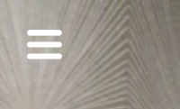 | Use it to build UI atop of AR.
| [Page](page.md) | 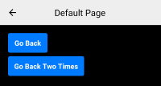 | Use it to build UI in the non-AR space.
| [Button](button.md) |  | One of the options for interacting with your app's user when being or not being tapped.
| [Container](container.md) |  | Allows you to organize the content on the screen.
| [Dialog](dialog.md) | 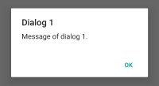 | One of the options for interacting with your app's user, showing messages atop of other content.
| [Form](form.md) | 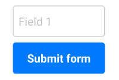 | A complex instrument connecting the client and the server sides.
| [Horizontal](horizontal.md) |  | Allows you to organize the group of identical, similar or different elements horizontally.
| [Image](image.md) | 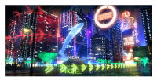 | Makes it possible for you to build in images.
| [Loader](loader.md) |  | Allows you to download data from the server to display it on page.
| [Text](text.md) | 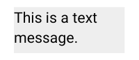 | Makes it possible for you to incorporate texts into your app.
| [TextField](textField.md) | 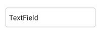 | Can be integrated into a form or used separately.
| [Vertical](vertical.md) | 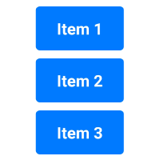 | Allows you to organize the group of identical, similar or different elements vertically.

## Related Links

- [UI Demo App](https://github.com/SpheroidUniverse/SpheroidScript/tree/master/examples/UI)
- [spheroid.client.ui package reference](../reference/spheroid.client.ui)
- [Got a question? Submit an issue on GitHub](../submit-an-issue.md)
