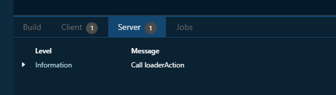
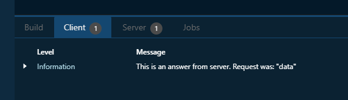
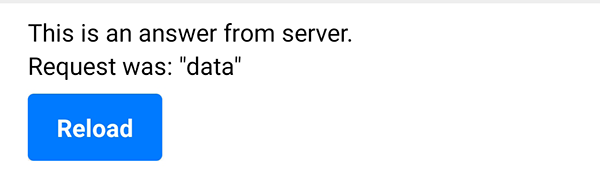

# Loader

On this page, we focus on one of the components of Spheroid UI Engine, a Loader.
You can find a quickstart with all source code you need to try the examples 
[here](https://github.com/SpheroidUniverse/SpheroidScript/tree/master/examples/UI).

Use Loader class when you need to download data from the server to display it on page.
When the user navigates to this page, the request is sent to the server automatically,
and the data is downloaded and built into the page.
If needed, `reload()` function can be called to clean up the page 
and send a new request to the server.

Below, you will find an example of using Loader class.

## Basics

On the client side, we create a loader, specifying a server action name,
as well as the request that will be sent to this server action:

```
Loader(action = "loaderAction", request = "data") { loader ->
    Result { result ->
        println(result)
        Vertical(top = 8dp, left = 18dp, right = 18dp) {
            Container {
                Text(text = result)
            }
            Container {
                Button(text = "Reload").onClick {
                    loader.reload()
                }
            }
        }
    }
    Error { error ->
        println(error.toString())
    }
}
```

Earlier, we've specified which action on the server side to call: `action = "loaderAction"`.
Now, on the server side, we create an action with the same name "loaderAction".
Note that we mark the action with the `@Action` decorator.

```
@Action
fun loaderAction(request) {
    println("Call loaderAction")
    return "This is an answer from server.\nRequest was: \"$request\""
}
```

Let's go through all the steps in our example.

When we've navigated to a new page, first thing that appeared on the page was
a loader:


We can see that the `loaderAction()` has been called in the "Server" tab
of the [Spheroid Demiurge IDE](https://demiurge.spheroiduniverse.io/ide):



Then, after the server has answered and returned the result, 
it is displayed in the "Client" tab
of the [Spheroid Demiurge IDE](https://demiurge.spheroiduniverse.io/ide):


 
On the mobile device, the text downloaded from the server was displayed:



## Related Links

- [Loader class reference](../reference/spheroid.client.ui/-loader/index.md)
- [Full list of UI components](index.md)
- [UI Demo App](https://github.com/SpheroidUniverse/SpheroidScript/tree/master/examples/UI)
- [Got a question? Submit an issue on GitHub](../submit-an-issue.md)