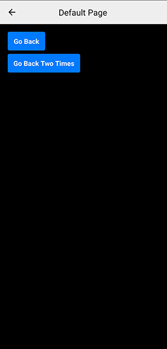
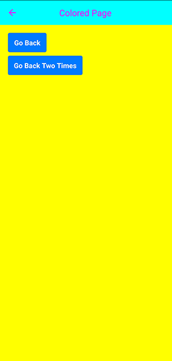

# Page

Introducing the Spheroid UI Engine, we need to focus on one of 
its two major components, a Page.

Along with [MainMenu](mainMenu.md), 
Page is a class you need to use in your app to build any UI.
Unlike MainMenu, which you use in order to build UI atop of AR, 
you use Page to organize different UI-elements,
like containers, buttons, icons, texts, etc. in non-AR space. 

You can find a quickstart with all source code you need to try the examples 
[here](https://github.com/SpheroidUniverse/SpheroidScript/tree/master/examples/UI).

## Basics

In many cases, you will want to give a page a title. Use the `title` property to do this.
If you want to change the background color, use the `backgroundColor` property.
Moreover, you can change the navigation bar (the bar at the top of the page) color and 
the title color with the `navigationBarBackgroundColor` and
`navigationBarForegroundColor`, respectively.

```
fun coloredPagePage() =
    Page(
        title = "Colored Page",
        backgroundColor = Color(rgb = 0xFFFF00),
        navigationBarBackgroundColor = Color(rgb = 0x00FFFF), 
        navigationBarForegroundColor = Color(rgb = 0xFF00FF)
    ) { page ->
        Button(text = "Go Back", top = 18dp, left = 18dp).onClick { 
            page.back()
        }
        Button(text = "Go Back Two Times", width = 170dp, top = 70dp, left = 18dp).onClick { 
            page.back(2)
        }
    }
```

|  Standard coloring scheme |  Custom coloring scheme |
| --- | --- |
|  |  |

## Navigation

As a UI component, the page has its unique features. 
One of them is the ability to open the page using the `navigate()` function, 
and the other is to step out of page using the `back()` function. 

When the user is browsing through the pages, the navigation stack is created, 
which means the navigation history is being saved. 
This is why you can make not only one, but two or more steps back. 
Just specify the quantity in the `back()` function arguments.

```
fun defaultPagePage() =
    Page(title = "Default Page") { page ->
        Button(text = "Go Back", top = 18dp, left = 18dp).onClick { 
            page.back()
        }
        Button(text = "Go Back Two Times", width = 170dp, top = 70dp, left = 18dp).onClick { 
            page.back(2)
        }
    }
```

Calling `defaultPagePage().navigate()` upon clicking a text, 
which will result in creating a page and opening it:

```
Container(height = 44dp) {
    Text(text = "Default Page", textColor = buttonColor, left = leftPadding, verticalAlign = "center")
}.onClick {
    defaultPagePage().navigate()
}
```

## Related Links

- [Page class reference](../reference/spheroid.client.ui/-page/index.md)
- [Full list of UI components](index.md)
- [UI Demo App](https://github.com/SpheroidUniverse/SpheroidScript/tree/master/examples/UI)
- [Got a question? Submit an issue on GitHub](../submit-an-issue.md)