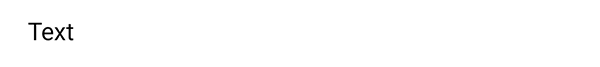
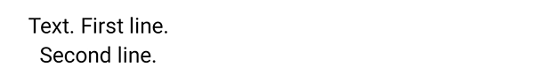
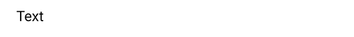
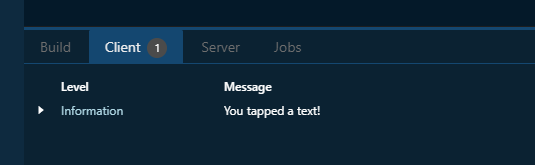
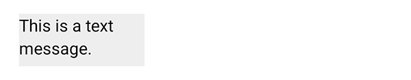
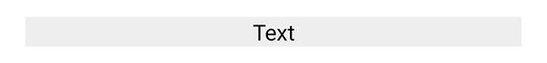
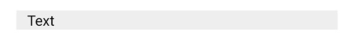
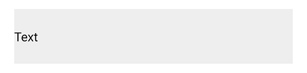
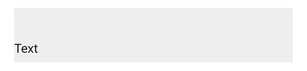

# Text

On this page, we focus on one of the components of Spheroid UI Engine, a Text.
You can find a quickstart with all source code you need to try the examples 
[here](https://github.com/SpheroidUniverse/SpheroidScript/tree/master/examples/UI).

Using Text class allows you to incorporate texts into the pages of your app, 
AR as well as non-AR. When creating an instance of Text class,
you need to set the `text` property value.

Below, you will find the examples of using Text class.
The images corresponding to each example illustrate how the text will look 
on the mobile device.

## Default settings

This is how the text will look on the page without changing the default settings:

```
Text(text = "Text")
```



## Visibility

A text is visible by default. However, there are 
cases when you need to turn the visibility on and off. You do this by setting the `isVisible`
property value `true` or `false`.

## Text size

Use the `textSize` property to customize the text size:

```
Text(text = "Text", textSize = 24dp)
```


## Text color

If you need to change the text color, set the `textColor` property value using a
[Color](../reference/spheroid.client.ui/-color/index.md) class instance:

```
Text(text = "Text", textColor = Color(rgb = 0x34C759))
```


## Text alignment

With the `textAlign` property, you can configure the text alignment in relation to itself:

```
Text(text = "Text. First line.\nSecond line.", textAlign = "center")
```



## Font weight

By default, the text font has normal weight. To make it bold, set the `fondWeight` property:

```
Text(text = "Text", fontWeight = "bold")
```


## `onClick` event handler

With the `onClick` event handler, you have the means to execute a script 
when the text is tapped. In an example, we just want to print a log message: 

```
Text(text = "Text").onClick {
    println("You tapped a text!")
}
```





## Width and height

Sometimes, you may need to define the area the text will occupy in advance.
For instance, this will be necessary if you want to group the text in two columns.
Your tools to do this will be the `width` and `height` properties:

```
Container(backgroundColor = Color(rgb = 0xEEEEEE)) {
    Text(text = "This is a text message.", horizontalAlign = "center", width = 120dp, height = 50dp)
}
```



## Horizontal and vertical alignment

Often, you need to change the relative position of a text to the external container.
You have a set of properties to do this. Note that by default the container is transparent, so
we have used a [Color](../reference/spheroid.client.ui/-color/index.md) class instance 
in the examples.

The `horizontalAlign` property sets the horizontal alignment of the text
to left, right or center:

```
Container(backgroundColor = Color(rgb = 0xEEEEEE)) {
    Text(text = "Text", horizontalAlign = "center")
}
```



The `left` and `right` properties allow you to place the text 
at an exact distance from the left or the right border of the external container:

```
Container(backgroundColor = Color(rgb = 0xEEEEEE)) {
    Text(text = "Text", left = 12dp)
}
```



The `verticalAlign` property sets the vertical alignment of the text
to top, bottom or center:

```
Container(backgroundColor = Color(rgb = 0xEEEEEE), height = 70dp) {
    Text(text = "Text", verticalAlign = "center")
}
```



Using the `top` and `bottom` properties, you can customize 
the distance between the text and the top or the bottom border of the external container:

```
Container(backgroundColor = Color(rgb = 0xEEEEEE), height = 70dp) {
    Text(text = "Text", bottom = 8dp)
}
```



## Related Links

- [Text class reference](../reference/spheroid.client.ui/-text/index.md)
- [Full list of UI components](index.md)
- [UI Demo App](https://github.com/SpheroidUniverse/SpheroidScript/tree/master/examples/UI)
- [Got a question? Submit an issue on GitHub](../submit-an-issue.md)