# TextField

On this page, we focus on one of the components of Spheroid UI Engine, a TextField.
You can find a quickstart with all source code you need to try the examples 
[here](https://github.com/SpheroidUniverse/SpheroidScript/tree/master/examples/UI).

Text fields are commonly integrated into forms 
(see more about [Form](form.md)).
Though, of course, they can be used separately. In this case you can write a complex 
validation logic that a form does not allow you to implement.

Below, you will find the examples of using TextField class.
The images corresponding to each example illustrate how the text will look 
on the mobile device.

## Default settings

This is how a text field will look without changing any default settings:

```
TextField()
```

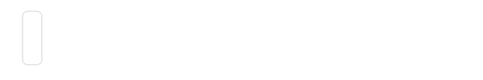

## Visibility

A text field is visible by default. However, there are 
cases when you need to turn the visibility on and off. You do this by setting the `isVisible`
property value `true` or `false`.

## Width and height

```
TextField(width = 200dp, height = 60dp)
```

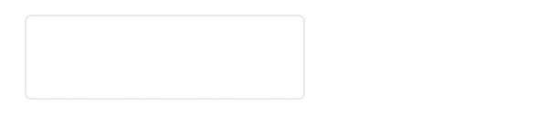

## Value

Sometimes, you may want to improve user experience by showing the user pre-entered
text in text fields, so the user doesn't have to type it in himself.
To do this, use the `value` property:

```
TextField(width = 200dp, value = "TextField")
```

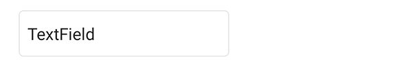

## Background color

If you need to change the background color of a text field,
use the `backgroundColor` property:

```
TextField(width = 200dp, value = "TextField", backgroundColor = Color(rgb = 0xFFFF00))
```

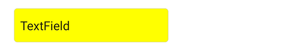

## Border width

By default, a text field has a border. You can customize its width with the
`borderWidth` property:

```
TextField(width = 200dp, value = "TextField", borderWidth = 3dp)
```

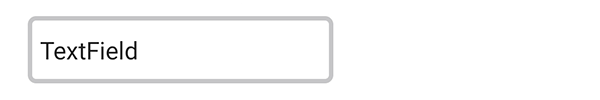

You can remove the border altogether by setting `borderWidth = 0`.

## Border color

Set the `borderColor` property value to highlight the border:

```
TextField(width = 200dp, value = "TextField", borderColor = Color(rgb = 0xFF0000))
```

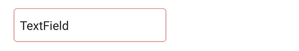

## Corner radius

If you need to make the border rounded, use the `cornerRadius` property:

```
TextField(width = 200dp, value = "TextField", cornerRadius = 22dp)
```

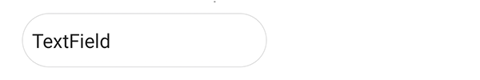

## Placeholder

If you want to place a short hint to the expected value of the text field, 
use the `placeholder` property:

```
TextField(width = 200dp, placeholder = "Placeholder")
```


## Placeholder color

You can control the placeholder color using the `placeholderColor` property:

```
TextField(width = 200dp, placeholder = "Placeholder", placeholderColor = Color(rgba = 0xFF000066))
```

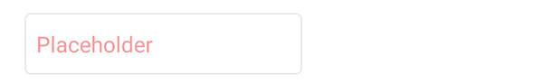

## Text size

Use the `textSize` property to customize the text value size:

```
TextField(width = 200dp, value = "TextField", textSize = 24dp)
```

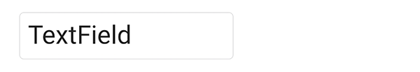

## Text color

If you need to change the text value color, set the `textColor` property value using a
[Color](../reference/spheroid.client.ui/-color/index.md) class instance:

```
TextField(width = 200dp, value = "TextField", textColor = Color(rgb = 0x34C759))
```

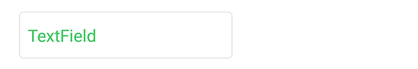

## Tint color

You can set the cursor and text selection color using the `tintColor` property:

```
TextField(width = 200dp, value = "TextField", tintColor = Color(rgb = 0xFF00FF))
```

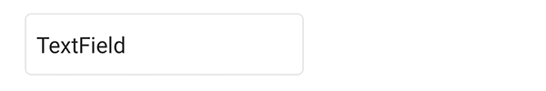

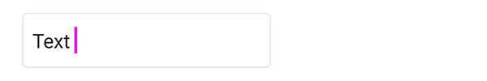

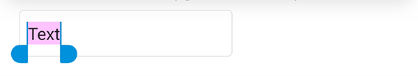

## Font weight

By default, the text value font has normal weight. 
To make it bold, set the `fondWeight` property:

```
TextField(width = 200dp, value = "TextField", fontWeight = "bold")
```

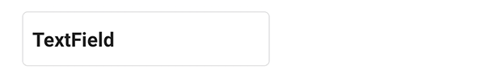

## Padding

Using the `padding` property, you can control the distance 
between the border's left side and the text:

```
TextField(width = 200dp, value = "TextField", padding = 2dp)
```


## Email and password fields

Set the `isEmail` property value to true for the field where the user types in his email.
Depending on the mobile device operational system, this will result in showing the user
a special keyboard layout for typing his email in. Commonly, the keyboard will have a "@"
symbol, and the first letter will be lowercase automatically.

```
TextField(width = 200dp, value = "mail@example.com", isEmail = true)
```

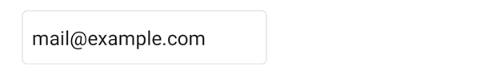

The `isSecure` property is typically used when creating a field where a user enters 
the password:

```
TextField(width = 200dp, value = "TextField", isSecure = true)
```

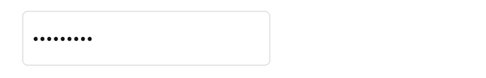

## `onFocusChange` event handler

With the `onFocusChange` event handler, you have the means to execute a script 
when the focus on the text field changes. This can be useful for design purposes 
as well as for reacting to user behaviour and more.
In an example, we just want to print a log message when the focus changes: 

```
TextField(width = 200dp, value = "TextField").onFocusChange { isOnFocus ->
    println("TextField is on focus: " + isOnFocus)
}
```

Focus is on the text field:

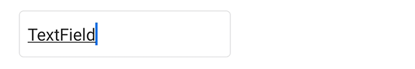

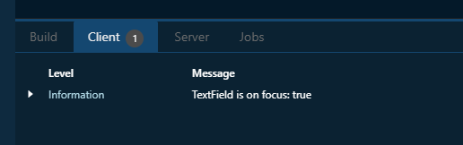

Focus has been moved away from the text field:

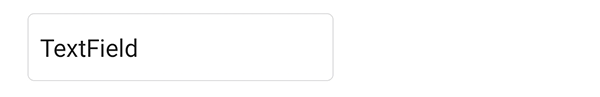

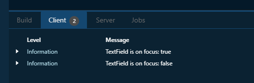

## Horizontal and vertical alignment

Sometimes, you need to change the relative position of a text field to the external container.
You have a set of properties to do this. Note that by default the container is transparent, so
we have used a [Color](../reference/spheroid.client.ui/-color/index.md) class instance 
in the examples.

The `horizontalAlign` property sets the horizontal alignment of the text field
to left, right or center:

```
Container(backgroundColor = Color(rgb = 0xEEEEEE)) {
    TextField(width = 200dp, value = "TextField", horizontalAlign = "center")
}
```

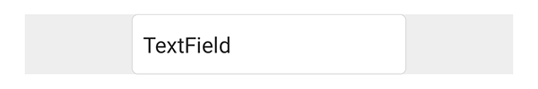

The `left` and `right` properties allow you to place the text field 
at an exact distance from the left or the right border of the external container:

```
Container(backgroundColor = Color(rgb = 0xEEEEEE)) {
    TextField(width = 200dp, value = "TextField", left = 12dp)
}
```

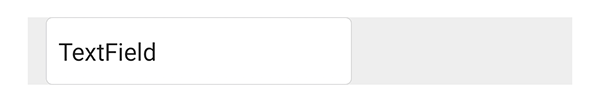

The `verticalAlign` property sets the vertical alignment of the text field
to top, bottom or center:

```
Container(backgroundColor = Color(rgb = 0xEEEEEE), height = 90dp) {
    TextField(width = 200dp, value = "TextField", verticalAlign = "center")
}
```

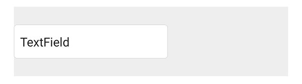

Using the `top` and `bottom` properties, you can customize 
the distance between the text field and the top or the bottom border of the external container:

```
Container(backgroundColor = Color(rgb = 0xEEEEEE), height = 90dp) {
    TextField(width = 200dp, value = "TextField", bottom = 8dp)
}
```

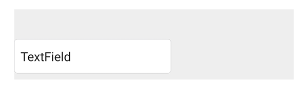

## Related Links

- [TextField class reference](../reference/spheroid.client.ui/-text-field/index.md)
- [Full list of UI components](index.md)
- [UI Demo App](https://github.com/SpheroidUniverse/SpheroidScript/tree/master/examples/UI)
- [Got a question? Submit an issue on GitHub](../submit-an-issue.md)