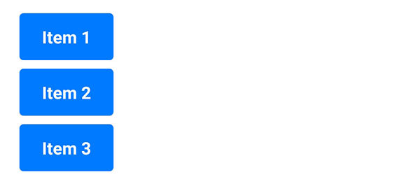
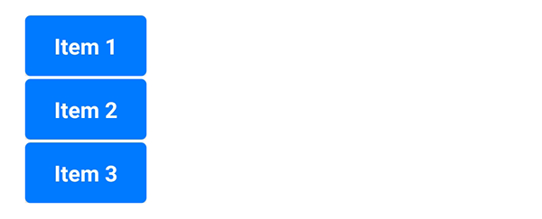
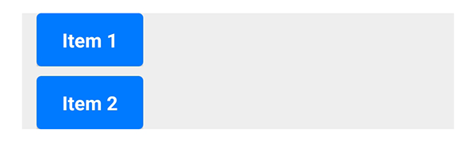
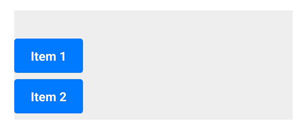

# Vertical

On this page, we focus on one of the basic components of Spheroid UI Engine, a Vertical.
You can find a quickstart with all source code you need to try the examples 
[here](https://github.com/SpheroidUniverse/SpheroidScript/tree/master/examples/UI).

As well as a [Horizontal](horizontal.md), a Vertical
serves to organize nested elements, the elements of one kind (buttons, images, etc.)
as well as elements of different kinds (an image and a text, and so on).

Every element nested inside a Vertical must be wrapped in a 
[Container](container.md).

Below, you will find the examples of using the Vertical class.
The images corresponding to each example illustrate how the vertical will look 
on the mobile device when using different settings.

## Default settings

This is how the buttons nested inside a vertical will look with the default settings: 

```
Vertical {
    Container {
        Button(text = "Item 1")
    }
    Container {
        Button(text = "Item 2")
    }
    Container {
        Button(text = "Item 3")
    }
}
```



## Visibility

A vertical is visible by default.
However, there are cases when you need to turn the visibility on and off. 
You do this by setting the `isVisible` property value `true` or `false`. If you set `false`,
all elements nested inside a vertical will become invisible too.

## Spacing

If you need to change the distance between the elements nested inside a vertical,
set the value of a `spacing` property:

```
Vertical(spacing = 2dp) {
    Container {
        Button(text = "Item 1")
    }
    Container {
        Button(text = "Item 2")
    }
    Container {
        Button(text = "Item 3")
    }
}
```



## Horizontal and vertical alignment

Sometimes, you need to change the relative position of a vertical to the external container.
You have a set of properties to do this. Note that by default the container is transparent, 
so we have used a [Color](../reference/spheroid.client.ui/-color/index.md) 
class instance in the examples.

The `horizontalAlign` property sets the horizontal alignment of the vertical
to left, right or center:

```
Container(backgroundColor = Color(rgb = 0xEEEEEE)) {
    Vertical(horizontalAlign = "center") {
        Container {
            Button(text = "Item 1")
        }
        Container {
            Button(text = "Item 2")
        }
    }
}
```


The `left` and `right` properties allow you to place the vertical 
at an exact distance from the left or the right border of the external container:

```
Container(backgroundColor = Color(rgb = 0xEEEEEE)) {
    Vertical(left = 12dp) {
        Container {
            Button(text = "Item 1")
        }
        Container {
            Button(text = "Item 2")
        }
    }
}
```



The `verticalAlign` property sets the vertical alignment of the vertical
to top, bottom or center:

```
Container(backgroundColor = Color(rgb = 0xEEEEEE), height = 150dp) {
    Vertical(verticalAlign = "center") {
        Container {
            Button(text = "Item 1")
        }
        Container {
            Button(text = "Item 2")
        }
    }
}
```


Using the `top` and `bottom` properties, you can customize 
the distance between the vertical and the top or the bottom border of the external container:

```
Container(backgroundColor = Color(rgb = 0xEEEEEE), height = 140dp) {
    Vertical(bottom = 8dp) {
        Container {
            Button(text = "Item 1")
        }
        Container {
            Button(text = "Item 2")
        }
    }
}
```



## Related Links

- [Vertical class reference](../reference/spheroid.client.ui/-vertical/index.md)
- [Full list of UI components](index.md)
- [UI Demo App](https://github.com/SpheroidUniverse/SpheroidScript/tree/master/examples/UI)
- [Got a question? Submit an issue on GitHub](../submit-an-issue.md)