# Hello, World!

This tutorial will take you through the steps to create and launch on your mobile phone 
a simple Hello World app powered by the Spheroid Universe Platform.

## Create an account in the Spheroid Universe Platform

Before you create your app, you need to [create an account](https://spheroiduniverse.io/marketplace/register) in the Spheroid Universe Platform.

If you already have an account in the Spheroid Universe Platform, you can skip this step.

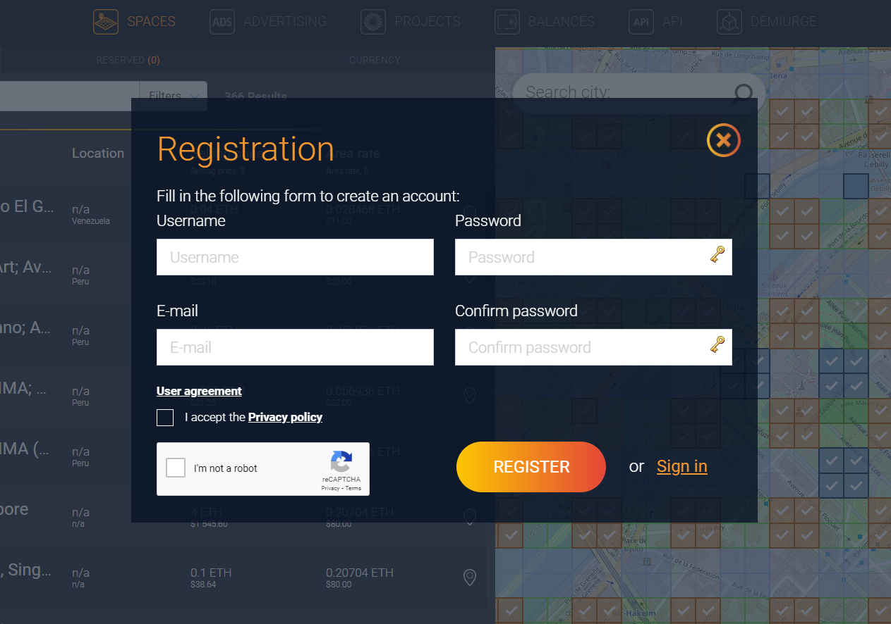

## Log in to the Spheroid Demiurge IDE

Now you have the access to all Platform services, including the Spheroid Demiurge IDE. 

Log in to the [Spheroid Demiurge IDE](https://demiurge.spheroiduniverse.io/ide), using the same email and password you used to register in the Platform.

## Create your app

Open the "Apps" tab and click the "Create" button. 


Enter the app name, leave the check on the "Create a layer corresponding to this app" box and click the "Create App" button. The app will be created along with the layer you will later use to publish the app into.


If the app doesn't get immediately created, and you get the error "Can't create an app because the app with the name 'xxx' already exists", it means the name you've chosen is already taken, so try another one.


## Create the app file structure

The simplest app in the Spheroid Universe Platform consists of 2 files:
* `app.json` - the app manifest file
* a script file with the `main` function which is the entry point of the app

### app.json

Create the "app.json" file: right-click the root folder (with the same name as your app) and select the "Create a file" option, then, when the dialog comes up, enter "app.json" and click "OK".

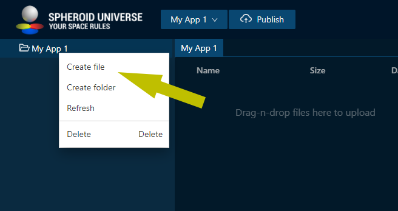

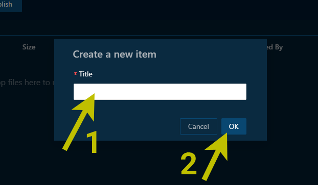

Then, left-click the "app.json" file and paste the following content into the editor area:

```
{
  "client": [
    "./Client.spheroid"
  ],
  "version": "1.0.0"
}
```

### An entry-point script file

Create the "Client.spheroid" file: right-click the root folder (with the same name as your app) and select the "Create a file" option, then, when the dialog comes up, enter "Client.spheroid" and click "OK".

Then, left-click the "Client.spheroid" file and paste the following content into the editor area:

```
fun main() {
    println("Hello world!")
}
```

### Double-check the file structure

As you finished the above steps, your file tree should look as follows:

```
(Your app name)
|--- app.json
\--- Client.spheroid
```

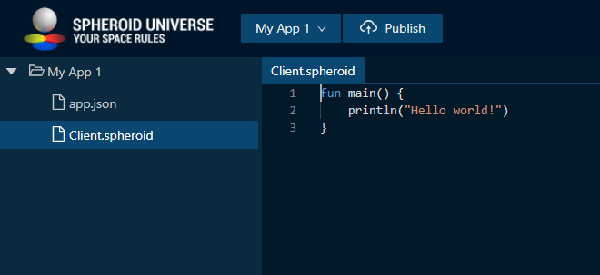

You're done! Now you can proceed to publishing the app.

## Publish your app

Click the "Publish" button in the top menu and, when the dialog comes up, keep the default settings, and click the "Publish" button at the right bottom of the dialog.

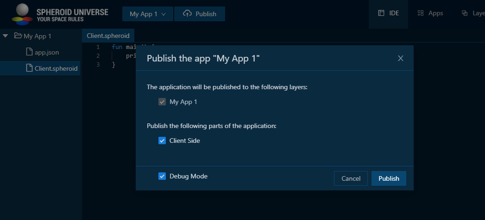

If the publication has been successful, you will see two info messages in the "Build" tab in the bottom pane. Congratulations, you have published your app!

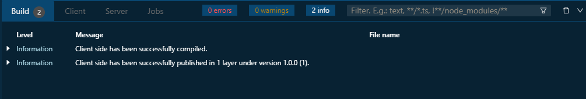

If you don't see the two info messages, or you see error messages instead, check you've followed the previous steps accurately and, if so, [write us an issue](../../docs/submit-an-issue.md), and we will help you solve the problem.

## Launch your app on your mobile phone

Now as you have your app built and published, it's time to run it on your mobile phone.

Download the XR Hub Android mobile app either by [following the Google Play link](https://play.google.com/store/apps/details?id=io.spheroid.spheroidandroid) or by scanning the QR code:


| 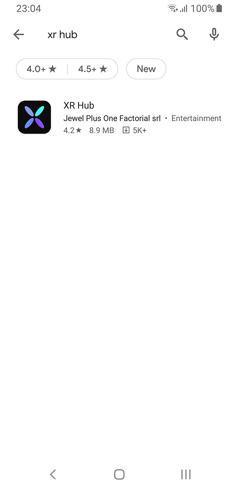 | 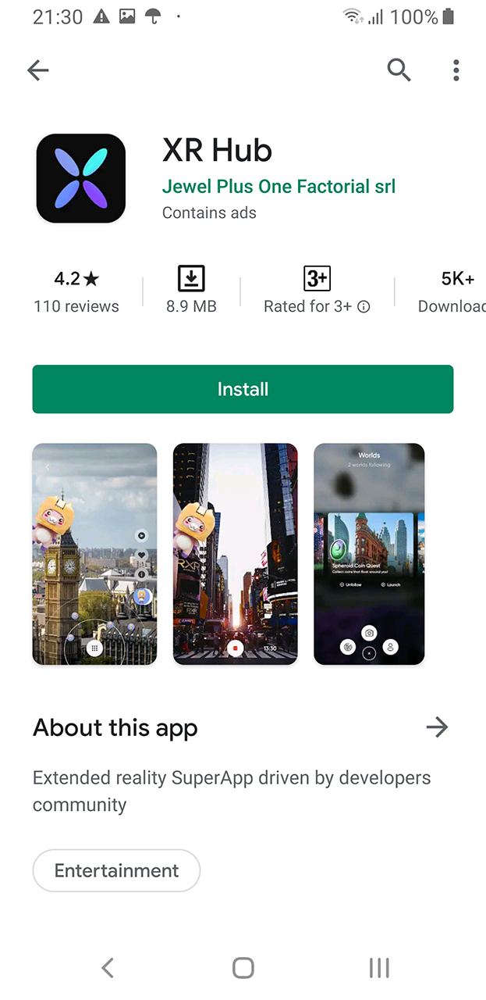 |  |  |
| --- | --- | --- | --- |
|  |  |  |  |

Currently, XR Hub works on the Android devices that [support ARCore](https://developers.google.com/ar/discover/supported-devices) only. iOS version of the app will be released soon.

Launch the XR Hub app on your phone.


| 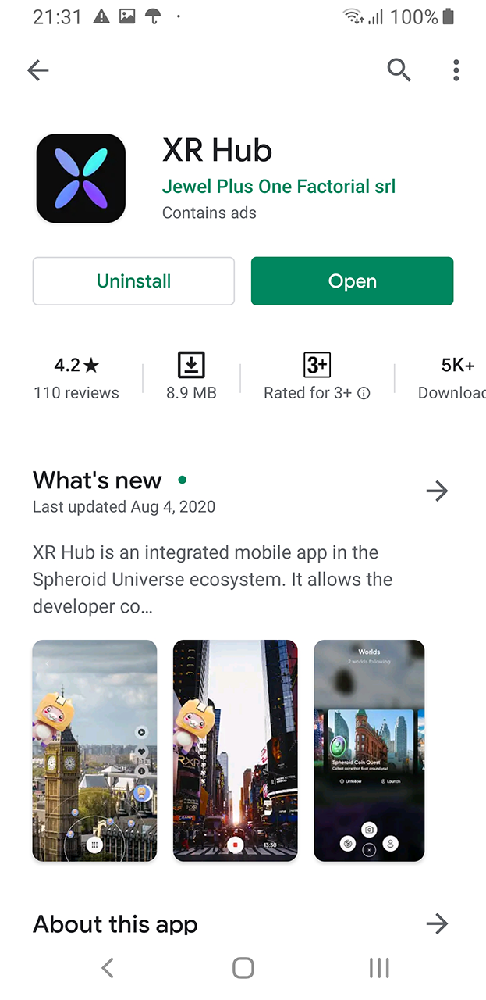 |  | 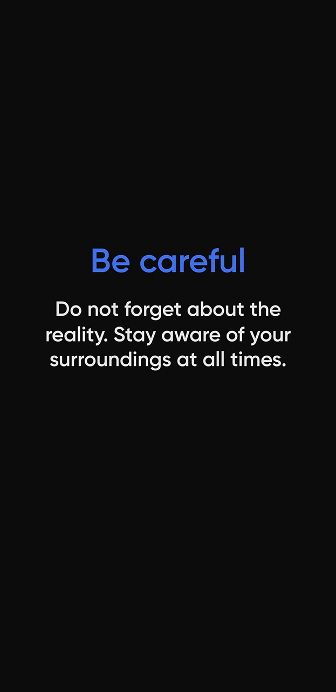 |  |
| --- | --- | --- | --- |
|  |  |  |  |

Tap the menu button in the bottom center, then tap the account icon and log in to the app using the same email and password you used to register in the Platform.

| 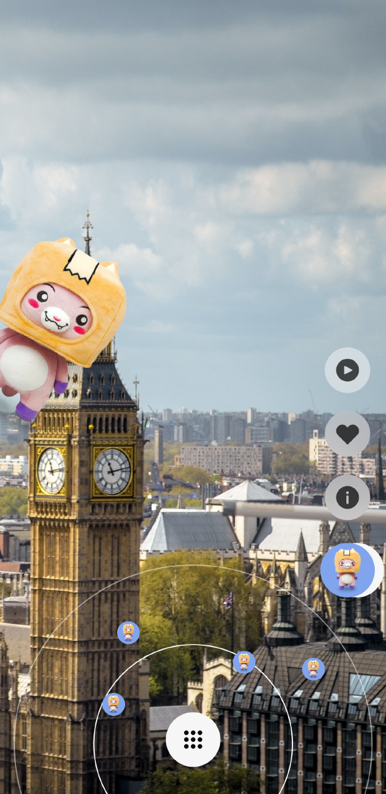 |  | 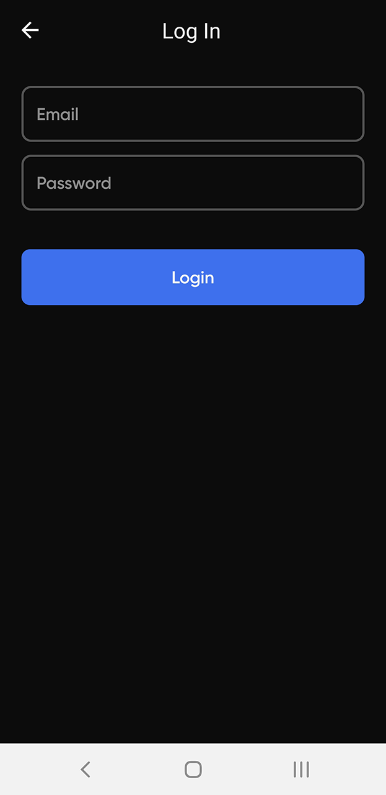 | 
| --- | --- | --- | --- |
|  |  |  |  |

When you're authorized, swipe right through the list of worlds to find the world your app has been published into (world is called "layer" in IDE). Note that if you're not logged in, you won't see the world, because the worlds created by developers are private. In the later tutorials you will learn how to add testers to your layer aka world.

| 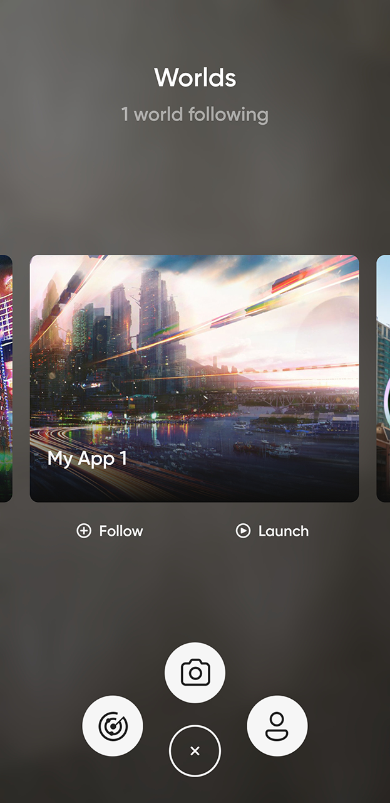 |  |  |  |
| --- | --- | --- | --- |
|  |  |  |  |

When you've found your world, tap the "Launch" button, and your app will run.

See the "Hello world!" log in the "Client" tab in the bottom pane.

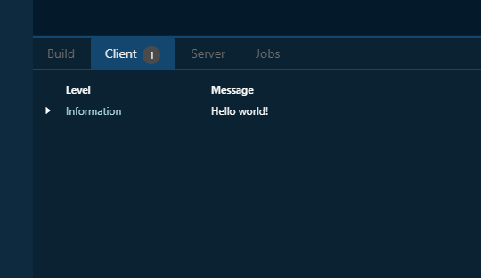
 
Congratulations, you have successfully run your app in the XR Hub! 

## Troubleshooting

If you have encountered any problems, please let us know by [submitting an issue](../../docs/submit-an-issue.md), we will make sure to help you find the solution. Please don't hesitate to contact us, as your issues and our replies will help to make our platform better and will be valuable to other developers.

## What's next?

- [More examples](..)
- [Spheroid Script Documentation](https://spheroiduniverse.github.io/SpheroidScript/)
- [Got a question? Submit an issue on GitHub](../../docs/submit-an-issue.md)